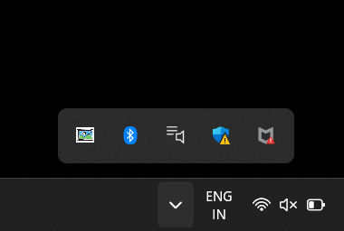

# Screen2Text

**Screen2Text** is a Java-based OCR tool that allows you to capture and extract text from any region of your screen. Simply select an area on your screen, and the tool instantly converts any visible text into an editable format using Optical Character Recognition (OCR).

---

## Features

- **Capture text** from any part of your screen.
- **System tray integration** for quick and seamless access.
- **User-friendly interface** with a transparent selection overlay.
- **Instant text extraction** powered by Tesseract OCR.
- **Copy extracted text** to your clipboard for easy reuse.

---

## How to Use

1. Launch the application.
2. Click on the system tray icon.
3. Select **"Capture Screen"**.
4. Click and drag to select the screen region containing text.
5. View the extracted text in the results window.
6. Copy and use the text as needed.

---

## Installation

1. **Clone** this repository:
   ```bash
   git clone https://github.com/neeraj1240/screen2text.git
   ```
2. Ensure **Java 11 or higher** is installed on your system.
3. Open the project in your preferred IDE (e.g., IntelliJ IDEA or Eclipse).
4. Locate the `Main.java` file.
5. Run the `Main` class to launch the application.

---

## Snapshots

### System Tray Icon
 <!-- Add the path or URL to the image -->

The application runs quietly in your system tray for quick access.


### Results Window


 <!-- Add the path or URL to the image -->

Extracted text appears in a clean, copy-ready format.


